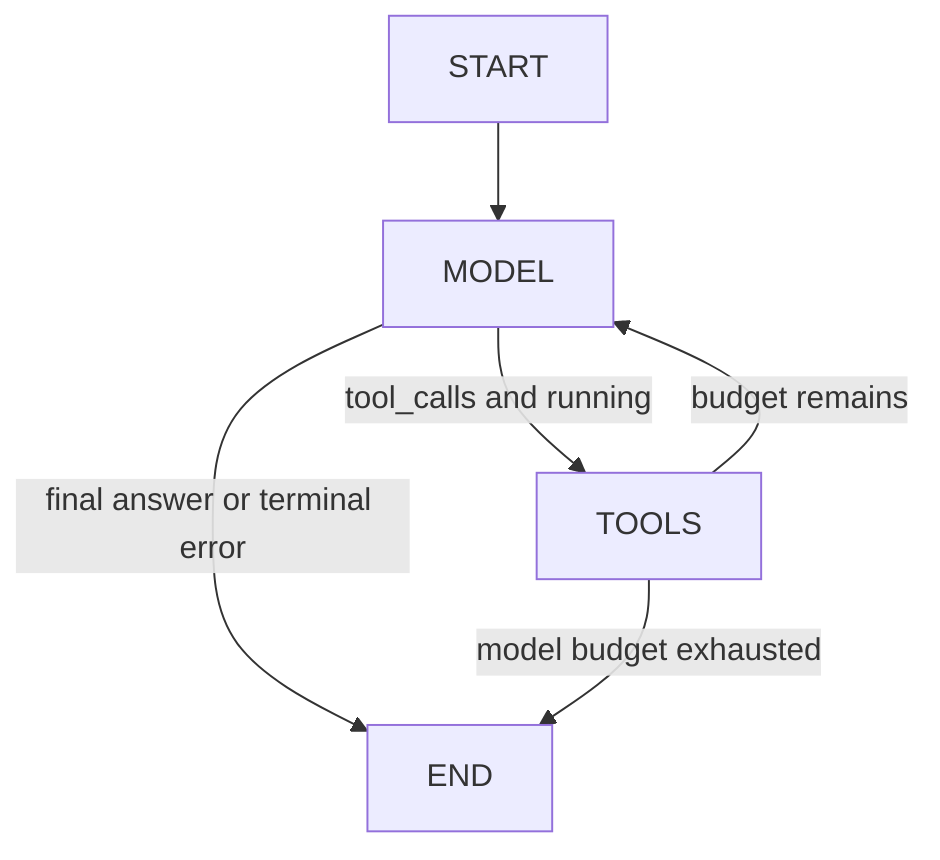
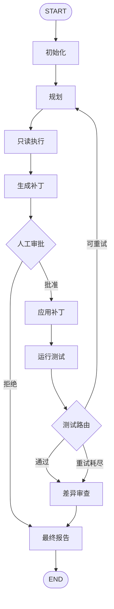

# RepoPilot 架构设计

## 1. 架构结论

RepoPilot 第一版采用“单 FastAPI 进程 + 显式 LangGraph StateGraph + 受限 LangChain Tools + SQLite Checkpointer”的结构。FastAPI 只负责 HTTP 边界和输入输出；LangGraph 是唯一的流程控制源；Pydantic 模型定义 API、State 子结构和工具参数；确定性 Python 服务负责工作区校验、Diff、审批复核、文件副作用、pytest 和最终审查。

这与 KamaClaude 的本地运行时方向不同。RepoPilot 不迁移 daemon、TCP/NDJSON/JSON-RPC、EventBus、TUI 或通用 shell，而是保留它们解决问题时形成的设计经验：明确终止条件、结构化工具结果、人工审批、上下文分层、失败可恢复和可追踪执行。

框架使用边界：

- Python 3.12：第一版唯一目标运行时；P0 再把现有占位 `requires-python` 与该约束对齐。
- LangChain：聊天模型抽象、结构化输出、工具 schema 和只读 `ToolNode`。
- LangGraph：节点、条件边、循环、interrupt/resume、checkpoint 和状态恢复。
- FastAPI：创建 run、查询状态、提交审批；不承担 Agent 编排。
- Pydantic v2：所有外部输入、模型输出、工具参数和结果的运行时校验。
- pytest：目标项目验证以及 RepoPilot 自身单元/集成测试。
- SQLite Checkpointer：本地持久化；开发早期可暂用 InMemorySaver，但第一版完成前必须切换 SQLite。
- LangSmith：可选的开发观测，不是运行依赖，也不是必需 Trace 存储。

官方能力依据：LangGraph 的 `StateGraph`/条件边用于显式路由，`interrupt()` 与相同 `thread_id` 的 `Command(resume=...)` 用于审批恢复，SQLite 通过独立的 `langgraph-checkpoint-sqlite` 集成提供 `SqliteSaver`/`AsyncSqliteSaver`。LangChain ToolNode 适合只读工具循环，但副作用工具不会交给模型自由调度。

## 2. 总体组件

| 层 | 计划职责 | 不承担的职责 |
| --- | --- | --- |
| `api/` | HTTP 路由、状态码、请求/响应模型绑定、thread ID 传递 | 计划、工具选择、文件写入 |
| `agent/` | 构建 StateGraph、节点、条件路由、提示词选择 | 直接访问任意路径或执行 shell |
| `schemas/` | State 子模型、API 模型、工具参数/结果、错误模型 | I/O 和业务编排 |
| `tools/` | 小而受限的 LangChain tools；统一返回结构化结果 | 通用 Bash、隐式审批、图路由 |
| `services/` | workspace guard、Patch 生成/应用、pytest、Git Diff、报告 | LLM Provider 细节 |
| `infrastructure/` | 模型工厂、SQLite checkpointer、可选 tracing 配置 | Agent 规则和文件业务 |
| `prompts/` | planner/executor 的短提示模板 | 安全边界；Prompt 不能代替代码校验 |

依赖方向保持单向：`api -> agent -> services/tools -> schemas`，`infrastructure` 由组合根注入。节点依赖通过构造参数注入，测试使用 fake model、临时 Git 仓库和临时 checkpointer。

## 2.1 P2 当前已实现的只读图

P2 的唯一生产执行引擎是无 Checkpointer 的编译 `StateGraph`。它只迁移 P1 的模型—工具消息协议，不包含后续规划、写入、审批、测试反馈、持久化或流式输出。



- `AgentState` 由 RepoPilot 显式定义；`messages` 使用 `add_messages`，工具审计列表使用追加 reducer。
- `ModelNode` 只调用已绑定工具的 LangChain Chat Model，写入增量 AIMessage、模型轮次和终态。
- 自定义 `ToolNode` 顺序执行同一 AIMessage 的全部调用，构造配对 ToolMessage，并保留 P1 安全与错误语义。
- `route_after_model` 与 `route_after_tools` 是只读纯函数；Graph Builder 用显式 path map 固定可能的边。
- `max_steps` 是 State 中的业务模型调用预算；LangGraph `recursion_limit` 仅是宽松的防御保险。
- 编译图可处理多个独立初始 State；没有 Checkpointer 时不会产生跨请求记忆，也不需要 `thread_id`。

对应实现位于 `src/repopilot/agent/state.py`、`nodes.py`、`routing.py`、`graph.py` 和 `services/agent_service.py`。P1 手写循环只保留在 Git 历史基线中。

## 3. LangGraph 最小闭环（目标版本）



相对用户给出的基线流程增加 `generate_patch` 节点，原因是把“LLM 提出修改”与“确定性生成、哈希和验证 Diff”分开；`conditional route` 明确命名为 `test_router`。`executor` 是一个受限只读子图：模型可以调用 `list_files`、`search_code`、`read_file` 收集证据，退出工具循环后再用结构化输出形成 `ChangeProposal`。它不能接触 `apply_patch`。

### 3.1 节点职责

| 节点 | 类型 | LLM | 工具 | 副作用 | 读写状态 | 终止/路由 |
| --- | --- | --- | --- | --- | --- | --- |
| `initialize` | 确定性 Python | 否 | Git/文件系统服务 | 只读探测 | 写 workspace、HEAD、限制和初始 trace | 校验失败直接 final_report |
| `planner` | 推理节点 | 是，结构化输出 | 否 | 无 | 读任务/测试失败摘要；替换 plan | 计划校验失败有限重试，失败后结束 |
| `executor` | 只读子图 | 是 | list/search/read | 无真实文件修改 | 追加 evidence/messages；写 proposed_edits | 工具轮次和文件/输出预算达到上限时结束子图 |
| `generate_patch` | 确定性 Python | 否 | programmatic `generate_patch` | 无 | 校验提案，写 patch、hash、candidate_files | 空 Patch 或冲突进入 final_report |
| `approval` | 确定性 interrupt | 否 | 否 | 无；只暂停 | 写 pending/approved/rejected 和审批记录 | reject -> final_report；approve -> apply_patch |
| `apply_patch` | 确定性 Python | 否 | programmatic `apply_patch` | **修改工作区** | 写 applied_files、post hashes 或错误 | 失配/失败立即停止，不自动重试写入 |
| `tester` | 确定性 Python | 否 | programmatic `run_tests` | **受控子进程**，可能生成缓存 | 写 TestResult、test_passed | 总是进入 test_router |
| `test_router` | 纯路由函数 | 否 | 否 | 无 | 读 test_passed/retry_count/max_retries | pass/retry/exhausted 三路 |
| `reviewer` | 第一版确定性审查 | 否 | `read_git_diff` | 只读 | 写 review_result | 总是进入 final_report |
| `final_report` | 受约束总结节点 | 是，可选结构化调用 | 否 | 无 | Python 先锁定事实与 outcome，LLM 只生成说明；失败时使用确定性模板 | END |

P7 可把 `reviewer` 升级为隔离的只读 reviewer subgraph；第一版先用确定性规则，避免为一天 Demo 引入多 Agent 调度和第二套权限模型。

### 3.2 LLM 使用规则

- `planner` 使用模型结构化输出生成 `ExecutionPlan`，Pydantic 校验步骤、目标文件候选和验收条件。
- `executor` 的探索轮次使用绑定的只读工具；随后单独调用结构化输出生成 `ChangeProposal`。工具调用与结构化提案分两步，避免依赖某个 Provider 同时支持两者。
- 测试失败后只把限长 `TestResult.summary`、相关失败片段、累计 Diff 摘要和当前计划送回 planner，不把完整 stdout/stderr 堆进 messages。
- `final_report` 可让模型把 Python 已锁定的状态、审批、Diff、测试结果和停止原因组织成自然语言；模型不能改写成功状态、退出码、重试次数或文件清单，结构化输出失败时回退到确定性模板。
- LLM 不决定工作区是否合法、不决定是否已审批、不直接写文件、不构造 shell 字符串、不决定重试是否越过上限。

### 3.3 循环与硬终止条件

| 循环 | 条件 | 上限 | 超限行为 |
| --- | --- | --- | --- |
| executor 只读工具循环 | 模型仍发出只读 tool call | `max_tool_rounds`，建议 8；累计读取/结果字节上限 | 形成错误并要求模型基于现有证据结束，仍失败则 final_report |
| 结构化输出修复 | Pydantic 校验失败 | 每个 LLM 节点最多 2 次 | 记录 `model_output_invalid`，结束 run |
| pytest 修复循环 | 测试失败且 `retry_count < max_retries` | Demo 默认 1，最大允许 2 | 进入 reviewer，最终报告为未完全成功 |
| 审批恢复 | 等待外部决定 | 无自动等待超时；API 可主动取消 | reject/cancel 结束；新 Patch 产生新审批 |

每次测试失败回到 planner 后都会重新经过 executor、generate_patch 和 approval，因此任何增量修改都不会复用旧批准。

## 4. API 边界

第一版只设计三个接口：

| 方法与路径 | 输入 | 输出 | 说明 |
| --- | --- | --- | --- |
| `POST /api/v1/runs` | `CreateRunRequest` | `RunView` | 新建 thread，运行到审批 interrupt 或 END |
| `GET /api/v1/runs/{thread_id}` | path 参数 | `RunView` | 从 checkpointer 读取当前状态、interrupt 或结果 |
| `POST /api/v1/runs/{thread_id}/approval` | decision、patch_hash、comment | `RunView` | 用相同 thread ID 和 `Command(resume=...)` 恢复 |

`RunView` 只暴露脱敏的状态投影，不直接序列化完整 State。审批接口必须同时提交用户看到的 `patch_hash`；服务器不接受只带布尔值的批准。第一版不做事件推送，客户端轮询即可。耗时节点使用异步图 API，但不引入队列或后台 worker。

## 5. Agent State 设计

State 使用 TypedDict 或等价的显式图 schema；嵌套结构使用 Pydantic v2。State 中只保存可序列化数据，不保存模型客户端、Path 对象、文件句柄、subprocess 或回调。

下表“进入模型”指是否会被节点有选择地构造为模型输入，不代表原样塞入 `messages`。

| 字段 | 类型 | 写入者 | 读取者 | 持久化 | 合并策略 | 进入模型 |
| --- | --- | --- | --- | --- | --- | --- |
| `messages` | `list[AnyMessage]` | planner/executor | executor | 是 | `add_messages`；仅模型对话 | 是，按预算裁剪 |
| `user_task` | `str` | API/initialize | planner、report | 是 | 首次写入，不合并 | 是 |
| `workspace_path` | `str` | initialize | 所有工具/服务 | 是 | 替换；恢复时重验 | 否，必要时给相对根说明 |
| `workspace_head` | `str` | initialize | apply/reviewer | 是 | 不合并 | 否 |
| `workspace_fingerprint` | `str` | initialize/apply | approval/apply | 是 | 每次合法变更后替换 | 否 |
| `plan` | `ExecutionPlan` | planner | executor/reviewer/report | 是 | 新规划整体替换，保留版本号 | 是 |
| `plan_version` | `int` | planner | report/trace | 是 | 递增 | 否 |
| `current_step` | `int` | executor | executor/report | 是 | 替换 | 可作为短上下文 |
| `candidate_files` | `list[str]` | executor/generate_patch | approval/apply/reviewer | 是 | 去重替换 | 是，仅相对路径 |
| `evidence` | `list[CodeEvidence]` | 只读工具适配层 | executor/planner/reviewer | 是 | 追加并按 `(path,line)` 去重 | 是，限长摘要 |
| `proposed_edits` | `list[FileEdit]` | executor | generate_patch/apply_patch | 是 | 每轮整体替换 | 否；其摘要来自模型输出 |
| `patch` | `str` | generate_patch | approval/reviewer/report | 是 | 每轮整体替换 | 否；仅 Diff 摘要可进入 |
| `patch_hash` | `str` | generate_patch | approval API/apply_patch | 是 | 每轮替换 | 否 |
| `approval_status` | `Literal[pending,approved,rejected,cancelled]` | approval | router/apply/report | 是 | 状态机替换 | 否 |
| `approval_record` | `ApprovalRecord | None` | approval | apply/report/trace | 是 | 每轮替换；历史另存 trace | 否 |
| `applied_files` | `list[str]` | apply_patch | tester/reviewer/report | 是 | 追加并去重 | 否 |
| `test_result` | `TestResult | None` | tester | test_router/planner/reviewer/report | 是 | 每轮替换；摘要进 trace | 是，仅失败摘要 |
| `test_passed` | `bool | None` | tester | test_router/report | 是 | 替换 | 否 |
| `retry_count` | `int` | test_router | planner/test_router/report | 是 | 递增 | 是，作为约束 |
| `max_retries` | `int` | initialize | test_router | 是 | 首次写入 | 是，作为约束 |
| `review_result` | `ReviewResult | None` | reviewer | final_report | 是 | 替换 | 否 |
| `final_report` | `FinalReport | None` | final_report | API | 是 | 只写一次；恢复可幂等重建 | 否 |
| `errors` | `list[AgentError]` | 任意节点的边界处理 | router/report | 是 | append reducer | 是，仅相关错误摘要 |
| `trace_events` | `list[TraceEvent]` | 节点包装器 | report/API | 是 | append reducer | 否 |
| `run_status` | `Literal[running,waiting_approval,succeeded,failed,rejected]` | 各控制节点 | API/report | 是 | 合法状态机替换 | 否 |

`CodeEvidence` 只存相对路径、行号范围、内容摘要和内容哈希；大文件正文仍从工具按需读取。`TestResult` 保存命令模板名、目标、退出码、耗时、是否超时、限长 stdout/stderr 和错误分类。完整二进制输出不进入 State。

## 6. 工具边界

### 6.0 决策责任与统一门控顺序

第一版明确划分职责，避免让 LLM 同时当提案者、裁判和执行者：

| 决策 | 负责人 | 代码证据位置（计划） |
| --- | --- | --- |
| 下一步读哪些文件、搜索什么 | LLM/executor | 只读工具调用与 evidence State |
| 生成什么修复方案 | LLM 结构化输出 | `ExecutionPlan`、`ChangeProposal` |
| 路径是否越界、symlink 是否安全 | Python | 统一 `WorkspaceGuard` |
| 命令是否允许 | Python | 不提供通用命令；只允许固定 pytest/Git 参数数组 |
| Patch 是否允许真实应用 | 用户 + Python 复核 | interrupt decision、Patch/hash/preimage 校验 |
| 测试是否通过 | pytest exit code + Python 分类 | `TestResult`、tester node |
| 是否超过重试次数 | LangGraph 确定性条件路由 | `retry_count < max_retries` |
| 最终总结 | LLM 表达；Python 锁定事实并提供模板回退 | State、Diff、测试与 trace 的结构化事实包 |

KamaClaude S5 中值得保留的动作顺序在 RepoPilot 中表达为：

```text
Pydantic 参数校验
→ Python 权限/工作区策略判断
→ 需要副作用时发起人工审批
→ 执行受限工具或 Patch
→ Python 失败分类
→ 结构化 ToolResult/State 回填给 Agent
```

参数格式错误属于给 Agent 的纠错信息，必须在审批前返回；用户不应该收到一张参数本身就非法的审批卡。只读工具通常在策略判断后自动执行，`apply_patch` 必须经过人工审批，`run_tests` 只能在已批准 Patch 成功应用后由确定性节点执行。失败信息只有在限长、分类后才进入下一轮模型上下文。

### 6.1 工具矩阵

| 工具 | 调用者 | 只读/副作用 | 是否审批 | 参数模型要点 | 输出 |
| --- | --- | --- | --- | --- | --- |
| `list_files` | executor ToolNode | 只读 | 否 | relative_path、max_depth、max_entries | `FileListResult` |
| `read_file` | executor ToolNode | 只读 | 否 | relative_path、start_line、end_line、max_bytes | `FileReadResult` |
| `search_code` | executor ToolNode | 只读 | 否 | query、globs、max_matches、context_lines | `SearchResult` |
| `generate_patch` | generate_patch 节点程序化调用 | 纯计算/读取 preimage | 否 | `list[FileEdit]`、workspace fingerprint | `PatchResult` |
| `apply_patch` | apply_patch 节点程序化调用 | **文件写入** | **是，且只接受已批准哈希** | patch_hash、edits、preimage hashes | `ApplyPatchResult` |
| `run_tests` | tester 节点程序化调用 | **受控进程副作用** | 不单独审批；只能在批准 Patch 后 | targets、timeout、max_failures | `TestResult` |
| `read_git_diff` | reviewer 节点程序化调用 | 只读 | 否 | max_bytes、unified_lines | `GitDiffResult` |

只有前三个工具绑定给 LLM。后四个虽然保持统一 Tool/Service 接口以便测试和观测，但由确定性节点直接调用，模型无法选择或伪造调用顺序。

### 6.2 Pydantic 校验

- 所有模型设置 `extra='forbid'`，拒绝模型偷偷添加未识别参数。
- 字符串先限制长度，再做语义校验；glob、测试目标、文件数、Patch 字节数均有上限。
- 相对路径模型拒绝空值、NUL、绝对路径、drive/UNC 前缀和 `..` 组件。
- enum 表达审批决定、错误类别和测试范围，不接受自由字符串。
- 工具失败返回 `ToolError(code, message, retryable, details)`，可预期错误不向图外抛裸异常。

### 6.3 Workspace Guard

所有文件工具共用同一个代码级 `WorkspaceGuard`，不能各自复制一套路径判断：

1. `workspace_path.resolve(strict=True)` 必须位于配置的 `allowed_workspace_root.resolve()` 内。
2. 工具只接受相对路径；目标用 `workspace / relative_path` 拼接后 `resolve()`。
3. 用 `os.path.commonpath`/`Path.is_relative_to` 复核 resolved target 仍在 workspace 内。
4. 拒绝指向工作区外的 symlink/junction；Windows 额外拒绝 UNC 和其他盘符。
5. 读取前、生成 Patch 时、审批恢复后、写入前各复核一次；写入依据 preimage SHA-256，防止审批后的 TOCTOU 替换。
6. 忽略 `.git/`、虚拟环境、缓存、二进制文件和配置的 deny globs。
7. 第一版要求初始 Git 工作树干净，并记录 HEAD；HEAD 或工作树在审批期间变化则批准失效。

KamaClaude 仅检查路径组件是否含 `..`，且测试直接使用绝对路径，无法满足上述边界，因此只能迁移“限制大小、返回截断标记、统一错误”的设计，不能原样迁移实现。

### 6.4 Shell 与超时

- 不提供通用 `bash`/`shell` 工具。
- `run_tests` 用 `asyncio.create_subprocess_exec(sys.executable, '-m', 'pytest', ...)`，每个参数独立传递，永不使用 `shell=True`。
- 只允许工作区内的测试目标；第一版不接受任意 pytest 参数、环境变量注入、插件安装或命令前后缀。
- `read_git_diff` 同样使用固定 `git -C <workspace> diff --no-ext-diff --no-color -- ...` 参数数组。
- 超时后先 terminate，短暂等待后 kill，并确保回收子进程；输出按字节上限截断，保留头尾和截断计数。
- timeout、nonzero_exit、path_denied、validation_error、stale_patch、tool_internal_error 分开建模；只有明确可恢复的错误可进入重规划。

## 7. Patch 与人工审批

### 7.1 Patch 形成

executor 输出 `FileEdit`：相对路径、操作类型、preimage SHA-256、精确旧片段和新片段。`generate_patch` 节点负责：

- 再次读取并核对 preimage；旧片段必须唯一匹配。
- 生成候选新内容和 unified diff，不写文件。
- 限制最多 10 个文件、单文件和总 Patch 字节。
- 拒绝 `.git/`、二进制、symlink 越界、超范围路径和无变化提案。
- 对规范化 `PatchResult` 计算 SHA-256，写入 `patch_hash`。

### 7.2 interrupt/resume 契约

approval 节点只做两件事：构造 JSON 可序列化的审批载荷并调用 `interrupt()`；恢复后校验 `ApprovalDecision`。它在 interrupt 之前不做写入，因为 LangGraph 恢复时会从节点开头重新执行。

审批载荷包含：thread ID、plan version、candidate files、unified diff、Patch hash、HEAD、风险和测试计划。API 恢复时必须使用同一 thread ID，并提交看到的 Patch hash。

### 7.3 应用前复核

`apply_patch` 执行顺序：

1. 状态必须是 approved，审批记录中的 hash 必须等于当前 hash。
2. Git HEAD、工作树状态、workspace fingerprint 和所有 preimage hash 必须仍匹配。
3. 先对全部文件做预检，再写任何文件。
4. 每个文件写临时文件、flush 后 `os.replace`；失败时用已保存 preimage 尽力回滚。
5. 写后读取并核对 postimage hash；记录修改文件。

拒绝、过期批准、未知决定和 Patch 改变都 fail closed。第一版不支持“审批时在线编辑 Patch”；用户若要修改方案，应拒绝并以新任务或反馈触发新规划。

## 8. pytest 反馈循环

tester 只在成功应用 Patch 后运行。`TestResult` 将完整过程压缩为可判定结构：

- `exit_code == 0` 且未超时：`test_passed=True`，进入 reviewer。
- 非零退出且错误分类为测试失败，并且重试预算未耗尽：`retry_count += 1`，带限长失败摘要回到 planner。
- collection error、环境缺失、超时或内部执行错误默认视为不可自动修复；进入 reviewer/最终报告。
- 重试达到上限：停止循环，保留当前工作树和失败结果，报告未完全成功。

每次重规划生成的是相对当前工作树的增量 Patch，但 reviewer 读取的是从初始干净 HEAD 到当前状态的累计 Diff。任何重试 Patch 都再次 interrupt，不能用第一次审批授权后续修改。

## 9. 持久化与 Session

第一版用 LangGraph thread 作为 session：

- API 创建稳定、不可猜测的 `thread_id`；所有 invoke/stream/get_state 使用同一 ID。
- graph compile 时注入 `AsyncSqliteSaver`；SQLite 文件放在 RepoPilot 自身数据目录，不写入目标项目。
- 必须在 approval 前后、apply 后、tester 后和 final_report 后形成 checkpoint；具体写入时机由图运行时管理，不再自建 SessionStore/thread.jsonl。
- 恢复时不能只信 checkpoint 中的路径和哈希；所有外部世界状态必须重验。
- 同一 thread 同时只允许一个执行/恢复请求；第一版通过应用级锁或串行约束实现，不做分布式锁。
- 状态保留策略、清理 API 和跨进程高并发不在第一版范围。

P4 开发审批时可暂用 `InMemorySaver` 验证 interrupt 语义；P6 必须切换 SQLite，之后第一版才满足“进程重启后可恢复审批”的规格。

## 10. Trace 与可观测性

必需 Trace 不依赖 EventBus 或云服务。每个节点通过统一包装器向 `trace_events` 追加小型 `TraceEvent`：node、attempt、started_at、finished_at、status、输入摘要、输出摘要和 error code。它与 State 一起 checkpoint，并进入最终报告。

不在 Trace 中保存 API key、环境变量、完整源文件或无限长工具输出。Patch 已在审批状态中保存，不在 trace 重复复制。

LangGraph 的 `astream` 可用于开发时观察 node updates；第一版 HTTP 不承诺实时推送。LangSmith 仅在显式环境配置下启用，并要求：

- 默认关闭；没有 key 时不影响功能。
- 私有仓库使用前得到用户同意。
- 关闭或脱敏完整 messages、Patch 和工具载荷。
- 本地 `trace_events` 始终是验收依据，不能把可测试性寄托在 LangSmith UI。

## 11. 异常处理

| 类别 | 示例 | 是否给 LLM | 是否重试 | 最终行为 |
| --- | --- | --- | --- | --- |
| 输入错误 | workspace 不存在、任务为空 | 否 | 否 | 4xx，图不启动 |
| 安全拒绝 | 越界路径、symlink、dirty tree | 否 | 否 | fail closed，报告原因 |
| 模型结构错误 | Plan/FileEdit 校验失败 | 是，给一次校验反馈 | 最多 2 次 | 超限结束 |
| 只读工具错误 | 文件不存在、结果过大 | 是，结构化 ToolMessage | 由模型换路径，受工具轮次上限约束 | 预算耗尽结束 |
| 审批拒绝/取消 | reject、hash 不匹配 | 否 | 否 | 不写文件，生成报告 |
| Patch 过期 | HEAD/preimage 改变 | 否 | 否 | 批准失效，禁止应用 |
| pytest 失败 | assertion failure | 是，限长摘要 | 受 max_retries 约束 | 重规划或失败报告 |
| pytest 环境错误 | command unavailable、timeout | 否，默认不可修复 | 否 | 审查并报告 |
| 内部异常 | 未知 exception | 否 | 否 | 记录安全摘要，状态 failed |

节点只捕获能转成领域错误的异常；`CancelledError` 等运行时控制信号不应被宽泛 `except Exception` 吞掉。对外错误消息脱敏，对内 trace 保留 error code 和必要上下文。

## 12. 安全不变量

以下条件必须由代码和测试保证，不能只写在 Prompt：

1. 模型绑定的工具集合中不存在 `apply_patch`、`run_tests` 或通用写工具。
2. 没有 approved 状态和匹配 Patch hash，就不存在到 apply_patch 的合法边。
3. 所有目标路径 resolve 后仍在 workspace 内；审批后写入前再次检查。
4. 所有子进程使用参数数组和固定可执行入口，不使用 shell。
5. 每个循环都有整数预算；预算存入 State 并由确定性 router 判断。
6. checkpoint 恢复不等于外部状态可信；HEAD、dirty state、文件 hash 必须重验。
7. 输出、Patch、文件数、搜索结果、messages 和 Trace 都有显式上限。
8. 初始 dirty Git 工作树、Git 元数据目录和工作区外 symlink 默认拒绝。
9. 测试、审查和报告节点不会隐式修改源码；pytest 产生的缓存属于已知受控副作用。
10. API 不返回绝对私有路径、密钥或完整内部异常堆栈。

## 13. 一天 Demo 的克制点

P0–P5 核心 Demo 只需要单 run、轮询 HTTP、一个模型、三个模型可见只读工具、一个 Patch 类型、一次默认重试和确定性 reviewer；路径守卫与审批属于这条闭环，不能后补。P6 再加入 SQLite 恢复、上下文预算和本地 Trace，达到第一版规格。P7 只选做只读 reviewer subgraph；SSE、Web UI、Skills、MCP、Dify、通用/后台 subagent、自动基线测试、跨项目 memory 和复杂 trace 查询都不得阻塞核心 Demo。
