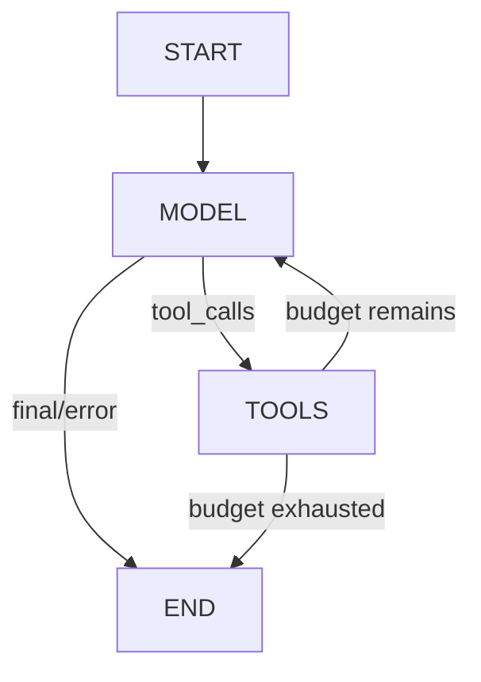

# P2：LangGraph StateGraph 学习笔记

## 1. P2 解决的问题

P1 已证明 Tool Calling 消息协议可行，但模型调用、工具执行、路由和终止全部挤在一个 Python 循环中。P2 保持三个只读工具和 HTTP 契约不变，把控制流拆成显式 State、Node、Edge，使每个状态写入者、分支和终止条件都能独立测试。

P2 仍不是代码修复 Agent：没有 Planner、Patch、写文件、命令、审批、测试反馈、持久化或 Trace。

## 2. 为什么从普通循环迁移到 Graph

普通循环短而直观，适合 P1 学习消息协议；当后续增加审批、测试反馈和恢复时，循环中的分支与状态会迅速耦合。StateGraph 把“做什么”放在节点，把“去哪里”放在边，把“已知事实”放在 State。本阶段先迁移最小循环，为后续阶段提供可验证的控制流边界，而不是提前实现后续功能。

## 3. State、Node、Edge

- State：一次调用内节点共享的数据契约，定义在 `src/repopilot/agent/state.py`。
- Node：读取完整 State，执行一个职责，返回局部更新。P2 只有 `model` 和 `tools`。
- Edge：声明节点间的固定或条件连接。P2 用 `START -> model` 固定边和两组条件边。



## 4. AgentState 字段职责

| 字段 | 职责 | 写入者 |
| --- | --- | --- |
| `messages` | Human/AI/Tool 完整协议历史 | 初始化、ModelNode、ToolNode |
| `model_calls` | 已实际执行的模型节点次数，也是 API `steps` | ModelNode |
| `max_steps` | 本次请求允许的最大模型调用轮次 | 初始化 |
| `status` | running 或明确终态 | 初始化、两个节点 |
| `final_answer` | 仅成功且 AIMessage 无 tool calls 时设置 | ModelNode |
| `error` | 稳定错误码与通用消息 | ModelNode、ToolNode、服务防御边界 |
| `tool_executions` | 顺序追加的脱敏工具审计摘要 | ToolNode |

State 不包含模型、工具、Settings、WorkspaceGuard、API Key、Base URL、FastAPI Request 或 compiled graph。这些对象由 builder、节点实例和服务组合。

## 5. `Annotated + reducer`

LangGraph 节点返回局部更新。带 reducer 的字段会把旧值和新值合并；没有 reducer 的字段采用本轮新值。P2 的 `messages` 使用 `add_messages`，`tool_executions` 使用 `operator.add`，其余控制字段由单个明确 writer 替换。

## 6. `add_messages` 为什么不简单覆盖

`add_messages(old, new)` 对新消息通常追加，并按消息 ID 支持更新既有消息。节点因此只需返回本轮新增 AIMessage 或 ToolMessage，不必复制整段历史，也不会因返回一条新消息而丢掉 HumanMessage。测试 `test_message_and_execution_reducers_append_partial_node_updates` 直接通过最小 StateGraph 验证追加行为。

## 7. 初始 State

`create_initial_state(goal, max_steps)` 先校验非空目标和 1–10 的模型预算，再为每次调用创建全新列表：

```text
messages = [HumanMessage(goal)]
model_calls = 0
max_steps = request.max_steps
status = running
final_answer = null
error = null
tool_executions = []
```

两个初始 State 不共享列表，也不依赖模块级可变默认值。

## 8. Model Node

输入是当前 `AgentState.messages`；依赖是 builder 已调用 `bind_tools()` 的模型。节点通过 `ainvoke()` 调用一次模型，将 `model_calls` 加一，并返回新增 AIMessage。若有 tool calls，状态保持 running；若无 tool calls，则非空内容成为 final answer；空内容成为 `invalid_model_response`；模型异常成为 `model_error`。

ModelNode 不查找或执行工具。它的副作用只有一次模型调用，测试模型完全离线。

## 9. Tool Node

输入前提是最后一条消息为带 tool calls 的 AIMessage。节点按原顺序逐个名称查找、参数校验和 `tool.invoke()`，每个调用都生成保持原 ID 的 ToolMessage 与 ToolExecutionRecord。未知工具、参数错误、工具异常或结构化失败都作为稳定 JSON 回填；某一项失败不跳过后续项。

若本轮工具执行后 `model_calls >= max_steps`，节点补齐全部 ToolMessage 后设置 `max_steps_exceeded`；否则保持 running。

## 10. 条件路由

`route_after_model`：非 running 一律 END；running 且最后 AIMessage 有 tool calls 才去 tools；其他非法 running 状态防御性 END。

`route_after_tools`：status 仍为 running 才回 model；任何终态都去 END。两者只读 State、不调用模型/工具、不计数、不写错误。

## 11. 消息逐节点变化

```text
初始：
messages = [HumanMessage]
model_calls = 0
status = running

model 后：
messages += AIMessage(tool_calls=[read_file])
model_calls = 1

tools 后：
messages += ToolMessage(tool_call_id=原调用 ID)
tool_executions += record

第二次 model 后：
messages += AIMessage(final)
model_calls = 2
status = success
final_answer = ...
```

## 12. model_calls 的变化

它只在 ModelNode 真正尝试一次调用时加一，包括模型调用抛错的轮次；一个 AIMessage 含几个 tool calls 都不影响该计数。ToolExecutionRecord 的 `step` 沿用 P1 API 字段名，但值表示产生该调用的模型轮次。

## 13. max_steps 与 recursion limit

`max_steps` 是业务预算，由 State 和 ToolNode 正常终止逻辑执行。最后允许的模型轮次若产生工具调用，ToolNode 仍补齐所有结果再 END。`recursion_limit = max(10, 2 * max_steps + 4)` 只是防止图结构错误造成失控循环；正常测试不依赖 `GraphRecursionError`。意外递归错误由服务转换为稳定错误，不输出堆栈。

## 14. 路由为什么必须纯

LangGraph 可在不同执行和可视化场景读取路由。若路由同时调用模型、执行工具或增加计数，状态变化就会依赖“路由被求值几次”，难以复现并可能重复副作用。P2 将所有写入放在节点，路由只做确定性判断。

## 15. 为什么模型和工具不进 State

它们是运行依赖，不是一次执行产生的事实。放入 State 会扩大序列化面、混入密钥/连接、破坏可测试性，并妨碍未来 checkpoint。Graph Builder 把模型和工具绑定到节点实例，State 只保留消息与小型结构化结果。

## 16. 为什么当前不使用 Checkpointer

P2 验证单请求内显式流程，不解决会话恢复。启用 Checkpointer 会引入 thread_id、存储生命周期、恢复一致性和敏感数据治理，属于 P6。当前 `compile()` 不传 checkpointer，测试直接断言 `graph.checkpointer is None`。

## 17. 编译 Graph 为什么可跨请求复用

编译结果保存的是图结构与节点依赖，不保存某次 invoke 的 State。每次 `ainvoke()` 都传入 `create_initial_state()` 的新字典；测试对同一 compiled graph 连续传入两个目标，证明消息和 final answer 不串联。

## 18. 无 Checkpointer 为什么不会记住上次请求

LangGraph 不会把上一次输出自动当成下一次输入。没有 checkpointer/store，且调用方每次提供普通初始字典，因此运行结束后的 State 只存在于该次返回值。脚本模型会记录测试输入，但它不是生产会话状态。

## 19. P1 Loop 与 P2 StateGraph 对照

| P1 | P2 |
| --- | --- |
| 局部 `messages` 列表 | `AgentState.messages` + reducer |
| `for step` | `model_calls` + 条件边 |
| 循环内调用模型 | `ModelNode` |
| 循环内遍历工具 | 自定义 `ToolNode` |
| `if tool_calls` | `route_after_model` |
| 下一轮/结束判断 | `route_after_tools` 与终态 |
| 返回前组装 Result | `AgentService` 投影 final State |

P1 源码保存在 Git 提交 `aa39eeb`，当前生产树不维护第二套相同引擎。

## 20. 与 KamaClaude AgentLoop/TaskManager 的区别

KamaClaude 的 AgentLoop 服务完整本地 Runtime，结合 Provider、EventBus、Session、权限、compact 和任务文件。RepoPilot P2 只借鉴消息配对、错误回填和有限终止的问题定义，控制流由 LangGraph 承担。TaskManager 的 JSON CRUD、任务依赖和 Planner 本阶段没有迁移。

## 21. 为什么不用预构建 ToolNode

P2 必须保持 P1 的同轮顺序执行、每次调用的审计记录、特定稳定错误码和“先补齐所有 ToolMessage 再判预算”的语义。小型自定义 ToolNode 让这些行为在一个明确边界内可测，避免为适配预构建节点增加额外包装。

## 22. 为什么不用 `create_agent`

本阶段学习目标是亲手定义 State、节点、边和终止条件。预构建 Agent 会隐藏关键控制流，也可能带入不需要的默认行为。P2 使用 LangGraph 低层 Graph API，且没有 AgentExecutor 或 Functional API。

## 23. 新增与迁移文件职责

- `agent/state.py`：State 类型、状态字面量、初始状态。
- `agent/nodes.py`：模型节点、自定义工具节点、稳定工具反馈。
- `agent/routing.py`：两个纯条件路由。
- `agent/graph.py`：工具绑定、节点/边注册和 compile。
- `services/agent_service.py`：初始 State、ainvoke、Result 投影和递归错误边界。
- `api/routes/agent.py`：异步调用服务，保持 HTTP 契约。
- `tests/scripted_model.py`：测试专用异步脚本模型。
- `scripts/demo_p2.py`：零网络图演示和 Mermaid 文本。

## 24. 主动修改练习

练习：仅在学习分支实现“工具连续失败两次时提前结束”。

1. State 增加 `consecutive_tool_failures: int` 和对应终态/错误。
2. ToolNode 根据本批结果更新计数；成功时清零，失败时累加。
3. `route_after_tools` 只读取计数和 status，决定 model 或 END。
4. 路由不能直接改计数，因为它应保持纯函数，且可能被框架为分析/可视化调用。
5. 测试：失败—失败提前结束、失败—成功清零、同轮多工具的计数定义、终止后不再调用模型、两个请求不共享计数。

该练习不默认进入生产，因为“失败两次”是否应该终止尚无产品需求。

## 25. 故障注入练习

| 注入 | 表现 | 定位与修复 |
| --- | --- | --- |
| 把 messages reducer 改为覆盖 | 下一轮缺 Human/AI 历史 | reducer 测试失败；恢复 `add_messages` |
| route_after_model 永远返回 tools | 最终回答后进入无调用 ToolNode | 路由/Graph 测试失败；按 status/tool_calls 分支 |
| ToolNode 漏一个 ToolMessage | 下一轮协议不完整、ID 数量不等 | 多工具顺序测试失败；每个 call 必须 append |
| model_calls 不增加 | max_steps 永不正常生效 | 节点与 max 测试失败；ModelNode 单 writer 加一 |
| 只依赖 recursion limit | 结果变异常而非业务终态 | API max 测试失败；在 ToolNode 设置终态 |
| 每个工具调用内重新 compile | 性能浪费且职责混乱 | builder 调用审查；只在服务组合时构建 |
| 初始 State 共享默认列表 | 跨请求消息污染 | 两 State/两请求隔离测试失败；函数内新建列表 |

## 26. 一分钟面试口述稿

RepoPilot P2 把 P1 的手写 Tool Calling 循环迁移成一个显式 LangGraph StateGraph。State 记录标准消息、模型调用轮次、预算、终态、最终回答、错误和工具审计；messages 与审计列表分别使用 add_messages 和追加 reducer。Graph 只有 model、tools 两个自定义节点：ModelNode 负责一次异步模型调用并追加 AIMessage，ToolNode 按模型顺序执行同轮全部只读工具，为每个调用补齐相同 ID 的 ToolMessage。两个纯路由只根据 status 和 tool_calls 在 model、tools、END 之间选择。max_steps 是 State 中的业务模型预算，recursion limit 只是防御保险。图不使用 Checkpointer、thread_id、interrupt 或预构建 Agent，因此同一 compiled graph 可处理多个独立初始 State，但不会产生跨请求记忆。API 仍是 `/agent/run`，三个只读工具和安全边界没有改变，所有测试使用脚本模型离线运行。

## 27. 必须亲手复写的四段代码

总量建议控制在 120–220 行，并按以下顺序脱离源码复写：

1. `AgentState` 与 `create_initial_state`：约 30–45 行，重点是两个 reducer 和全新列表。
2. `ModelNode`：约 40–60 行，覆盖 tool calls、成功、空内容和模型异常。
3. 两个路由函数：约 15–25 行，只读 State 并返回显式 Literal。
4. `build_agent_graph`：约 30–45 行，完成绑定、节点、固定边、条件边和 compile。

复写后先运行 `test_agent_state.py`、`test_agent_nodes.py`、`test_agent_routing.py`、`test_agent_graph.py`，再跑全量测试。
